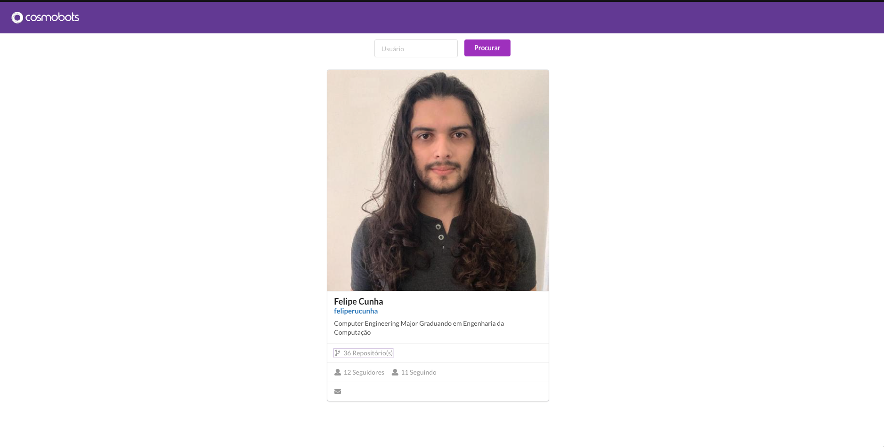
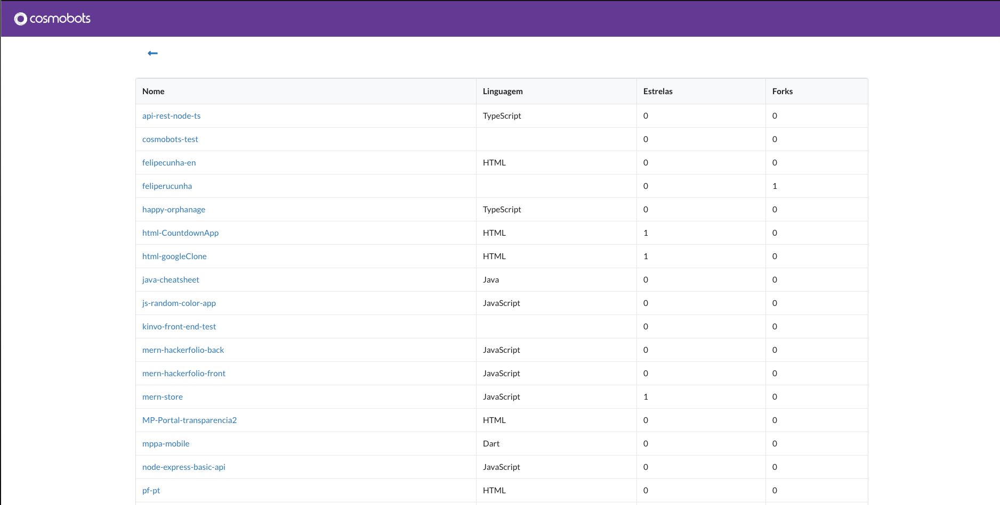

# Prova Frontend para a empresa Cosmobots
## Como rodar o projeto
* Digite o comando "yarn" sem aspas na pasta raiz do projeto
* Digite o comando "yarn start" sem aspas após instalar as dependências com o comando acima.
* Acesse http://localhost:3000/ e comece a usar

## Usando
* Ao pesquisar pelo nome de usuário github, um card mostra os dados cadastrados do referente usuário.
* Caso o usuário não exista, uma página de erro é exibida.
* Ao encontrar um usuário, você pode selecionar seus repositórios, sendo assim redirecionado a outra página.
* Na página de repositórios você pode verificar todos os repositórios daquele usuário.
* Para voltar à página de pesquisa, basta clicar na logo na navbar.

## Pontos a melhorar
* Utilização de styled components.
* Habilitar paginação.
* Hospedar (deploy).

### Imagens da aplicação funcionando

